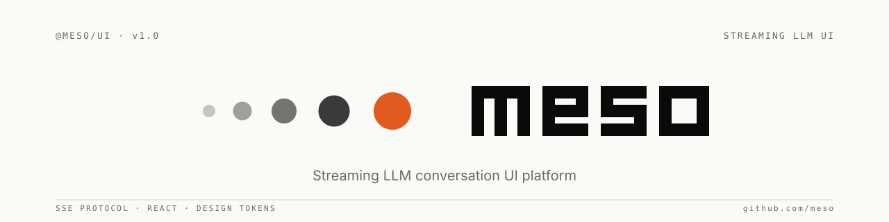

<picture>
  <source media="(prefers-color-scheme: dark)" srcset="brand/stream/banner-dark.svg">
  
</picture>

<br/>

**Meso** 是面向流式 LLM 交互的前端平台层，提供：

- **SSE 事件协议**（版本化、可机器验证）
- **可发布 React 组件库** `@meso/ui`（ESM + CJS + TypeScript 声明）
- **无 React 依赖的运行时** `@meso/ui/runtime`（状态机 / 解析器）
- **设计规范**（布局、设计 token、主题）

第三方应用负责：后端实现、鉴权、会话持久化、Tools/知识库/记忆等业务逻辑。  
平台负责：**协议稳定、UI 可替换、扩展机制清晰**。

---

## 快速接入

```bash
npm install @meso/ui @meso/types
# 或
pnpm add @meso/ui @meso/types
```

> **注意**：不推荐用 `github:#path:` 安装，会导致构建工具解析到 monorepo 根目录。
> 详见 [消费指南](docs/consuming.md)。

```tsx
import '@meso/ui/tokens.css'
import '@meso/ui/style.css'
import { ThreeColumnLayout, MessageList, useSSEStream } from '@meso/ui'

export function App() {
  const { state, start, abort } = useSSEStream('https://your-backend/stream')

  return (
    <ThreeColumnLayout appName="My App" navItems={[...]}>
      <MessageList
        messages={completedMessages}
        streaming={state}
        renderMarkdown={(src) => DOMPurify.sanitize(marked(src))}
      />
    </ThreeColumnLayout>
  )
}
```

后端只需按 [SSE 协议规范](docs/streaming-protocol.md) 发送事件流，无需部署平台代码。

### 推荐集成路径

| 场景 | 推荐方式 |
|------|----------|
| React 应用 | `useSSEStream` hook — 封装了 fetch、parseSSELine、applyEvent 和状态管理，开箱即用 |
| 自定义 transport（WebSocket、轮询等） | `parseSSELine` + `applyEvent` — 只需对接数据来源，状态机行为与 hook 完全一致 |
| 非 React 环境 | `import '@meso/ui/runtime'` 或直接 `@meso/types` — 零 React 依赖 |

> **不推荐**：自行 `JSON.parse` SSE 数据并手写状态机。会遗漏 `[DONE]` 哨兵处理、
> `schema_version` 兼容性检查和多 artifact 并发逻辑，形成平行维护负担。

### 版本兼容性检查（可选但推荐）

```tsx
import { isCompatibleVersion, assertCompatibleVersion } from '@meso/ui'

// 宽松模式：不兼容时静默跳过
if (!isCompatibleVersion(event)) return

// 严格模式：不兼容时抛出，适合开发/测试环境
assertCompatibleVersion(event)  // throws: "Meso protocol version mismatch: ..."
```

---

## 平台边界

| 平台提供 | 应用侧负责 |
|----------|-----------|
| SSE 协议约定与 React 组件 | 业务后端 / API 服务 |
| 设计 token（亮/暗双主题） | 用户鉴权与会话持久化 |
| `useSSEStream` 客户端 Hook | Tools 执行引擎 |
| 三栏布局 + 分屏 | 知识库检索 / 记忆存储 |
| Artifact 面板（代码/HTML/Mermaid） | Composer 工具栏 |

---

## 包结构

| 导入路径 | 内容 | React |
|----------|------|-------|
| `@meso/ui` | 全部组件 + Hook + 运行时类型 | ✅ |
| `@meso/ui/runtime` | `parseSSELine` / `applyEvent` / `createInitialStreamState` | ❌ |
| `@meso/ui/tokens.css` | CSS 变量，亮/暗双主题 | — |

---

## 组件一览

| 组件 | 用途 |
|------|------|
| `ThreeColumnLayout` | 三栏应用壳（侧栏 / 会话列 / 主区 + 分屏） |
| `MessageList` | 多轮对话渲染，合并历史消息与流式状态 |
| `ChatBubble` | 用户 / 助手消息气泡，支持 Markdown |
| `ThinkBlock` | 可折叠推理过程块 |
| `StageTimeline` | 流水线阶段进度指示器 |
| `ArtifactPanel` | 代码 / HTML / Mermaid / Markdown / 表格面板 |
| `WorkflowTimeline` | 工作流节点进度（含并行分支） |
| `ToolCallBlock` | 工具调用状态展示（含确认门控） |
| `SoulIndicator` | 角色人格芯片（头像 + 特质标签） |
| `SkillIndicator` | 技能徽章（专注方向） |
| `useSSEStream` | SSE 客户端 Hook（POST / AbortController） |
| `useTheme` | 亮暗主题切换（`data-theme` + `localStorage`） |

---

## SSE 协议

```
data: {"type":"<event_type>","schema_version":"1.0","payload":{…}}\n\n
```

**标准事件**：`stage` · `memory` · `think` · `text` · `artifact` · `tool_call` · `tool_result` · `workflow_node` · `done` · `error`

**扩展事件**（第三方业务事件，不改平台代码）：

```json
{"type":"extension","schema_version":"1.0","payload":{"name":"tool_progress","data":{…}}}
```

规范文档：[`docs/streaming-protocol.md`](docs/streaming-protocol.md)

---

## 主题 token

```css
/* 公开稳定 token（SemVer 保护） */
--color-bg / --color-bg-elevated / --color-bg-white / --color-bg-sidebar
--color-text / --color-text-secondary / --color-text-muted
--color-accent / --color-accent-dark
--color-border / --color-border-light
--color-error / --color-warning / --color-success / --color-info
--color-code-bg / --color-code-text
--sidebar-w / --sidebar-w-collapsed / --session-col-w
```

FOUC 防护（放在 `<head>` 内 `tokens.css` 之前）：

```html
<script>
(function(){
  var t = localStorage.getItem('meso-theme') || 'light';
  document.documentElement.setAttribute('data-theme', t);
})();
</script>
```

---

## Monorepo 外消费

```bash
# 先 types，再 ui
pnpm --filter @meso/types run build
pnpm --filter @meso/ui run build
```

```json
{
  "dependencies": {
    "@meso/types": "file:../meso/packages/meso-types",
    "@meso/ui":    "file:../meso/packages/meso-ui"
  }
}
```

---

## 文档

| 文档 | 内容 |
|------|------|
| [消费指南](docs/consuming.md) | npm/tarball/file: 安装方式对比、故障排查 |
| [SSE 协议规范](docs/streaming-protocol.md) | 事件类型、信封格式、扩展机制 |
| [接入指南](docs/integration-guide.md) | 从安装到首轮流式对话 |
| [流式对话设计](docs/streaming-design.md) | 状态机与前端处理细节 |
| [架构总览](docs/architecture.md) | 系统分层、模块划分 |
| [UI 规范](docs/ui-spec.md) | 布局、配色、字体、动画 |
| [应用插件系统](docs/app-plugin-system.md) | App Manifest、Tools、Knowledge |
| [升级迁移](packages/meso-ui/CHANGELOG.md) | Breaking Changes 对照表 |

---

## 版本管理

遵循 [SemVer](https://semver.org/)：Patch = bug fix · Minor = 新功能（向后兼容）· Major = Breaking Changes。  
协议层变更须先更新 `docs/streaming-protocol.md` 和契约测试 fixture，再发 `@meso/ui`。
