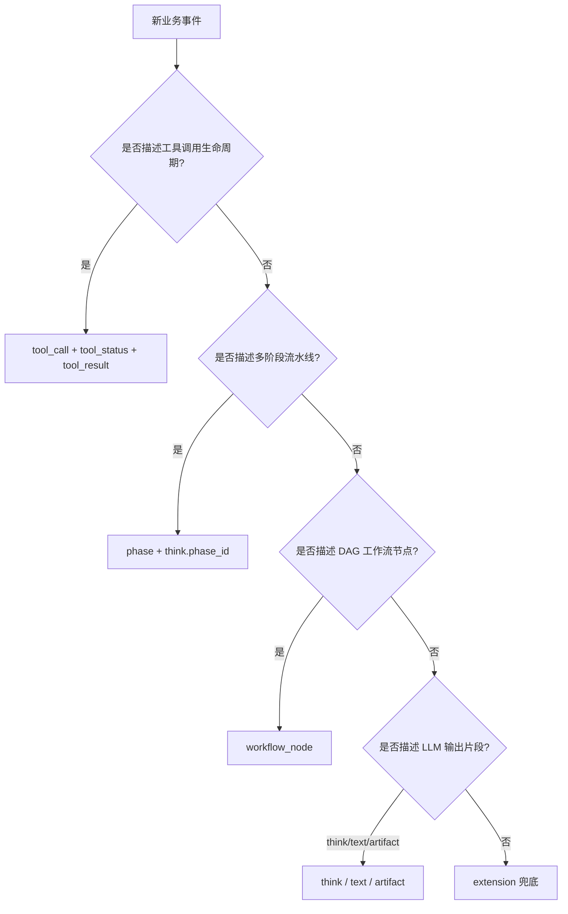

# 扩展事件指南

本文说明第三方如何通过扩展事件机制传递业务语义事件，以及平台在时序、历史消息方面的约定。

---

## 为什么需要扩展事件

平台内置标准事件，涵盖：
`capabilities` / `soul` / `skill_active` / `phase` / `memory` / `memory_saved` /
`tool_call` / `tool_result` / `tool_status` / `resource_read` / `resource_content` /
`think` / `text` / `artifact` / `workflow_node` / `done` / `error` / `extension`

**选择标准事件还是扩展事件**：语义上匹配标准事件时，始终优先使用标准事件。
例如，工具调用应使用 `tool_call` + `tool_status` + `tool_result`，而不是自定义 extension——
标准事件有完整的平台 UI 支持（`ToolCallBlock`、`ConfirmGate`、风险徽章等）。

扩展事件适用于平台无法预见的业务语义，例如：

- 视频生成进度（`video_progress`）
- 业务实体引用（`entity_reference`）
- 会话元数据更新（`session_meta`）

**扩展事件机制允许第三方传递任意业务事件，而无需 fork 或修改平台源码。**

---

## 决策树：标准事件 vs extension



| 场景 | 推荐 |
|------|------|
| 工具开始/执行中/完成 | `tool_call` → `tool_status` → `tool_result` |
| 需用户确认的危险操作 | `tool_call` + `requires_confirm: true` + `ConfirmGate` |
| 多阶段任务（理解→检索→生成） | `phase` 事件 |
| 视频生成进度、业务实体卡片 | `extension` |

---

## Wire Format

```
data: {"type":"extension","schema_version":"1.0","payload":{"name":"<extension_id>","version":"1.0","data":{…}}}\n\n
```

| 字段 | 必填 | 说明 |
|------|------|------|
| `payload.name` | ✅ | 扩展标识符，如 `"citation"`、`"entity_reference"` |
| `payload.version` | ❌ | 扩展 schema 自身的版本号（语义化，可选） |
| `payload.data` | ✅ | 任意对象，结构由扩展定义，平台不解析 |

---

## 后端示例

```python
# Python / FastAPI — 引用来源卡片（非工具类扩展）
async def stream_with_citation():
    yield f'data: {json.dumps({"type":"extension","schema_version":"1.0","payload":{"name":"citation","data":{"source":"paper-42","title":"Meso Protocol"}}})}\n\n'
    yield f'data: {json.dumps({"type":"text","schema_version":"1.0","payload":{"delta":"根据文献，"}})}\n\n'
    yield f'data: {json.dumps({"type":"done","schema_version":"1.0","payload":{}})}\n\n'
```

工具调用请使用标准事件，见 [`docs/help/tools.md`](help/tools.md)。

---

## 前端渲染

通过 `MessageList` 的 `renderExtension` prop 渲染扩展事件 UI：

```tsx
import { MessageList } from '@meso.ai/ui'
import type { ExtensionEvent } from '@meso.ai/ui'

<MessageList
  messages={messages}
  streaming={state}
  renderExtension={(event: ExtensionEvent) => {
    switch (event.payload.name) {
      case 'citation':
        return <CitationCard data={event.payload.data as CitationData} />
      case 'entity_reference':
        return <EntityRefCard data={event.payload.data as EntityRefData} />
      default:
        return null
    }
  }}
/>
```

`renderExtension` 不提供时，扩展事件静默忽略，不影响其他渲染。

---

## 时序约定

### extensionLog（时序渲染）

`StreamState.extensionLog` 按事件到达顺序追加，**保证严格时间序**。

使用场景：多个扩展事件交替出现，需要按顺序渲染。

```typescript
state.extensionLog
// → [citation(...), entity_reference(...)]
```

`renderExtension` 接收的正是 `extensionLog` 中的事件，按顺序调用。

### extensions（按名称查找）

`StreamState.extensions` 以 `name` 为 key，存储同名事件的数组：

```typescript
state.extensions['citation']
// → [event(paper-42), event(paper-43)]
```

使用场景：需要"取某类事件的最新状态"时。

**两者同时维护，选择适合场景的结构。**

---

## 历史消息中的扩展事件

### 平台的明确约定

> **扩展事件仅在当前流式轮次（`StreamState`）中展示。**  
> 平台不持久化扩展事件，不负责在历史消息中重现扩展 UI。

原因：扩展事件是业务实现细节，其持久化格式属于第三方业务领域，平台无法统一处理。

### 第三方如何处理历史轮次的扩展 UI

**模式 A：落库时折叠为 metadata**

流结束后，将扩展事件汇总为 `message.metadata`，历史渲染时按 metadata 自行绘制：

```typescript
const messageRecord = {
  id: uuid(),
  role: 'assistant',
  content: state.textContent,
  metadata: {
    citations: state.extensions['citation']?.map(e => e.payload.data),
  },
}
```

**模式 B：明确声明"仅当前轮次"**

对于一次性 UI，历史中不显示扩展内容是合理的。在 `renderExtension` 中直接渲染，流结束后随 `StreamState` 重置自然消失。

---

## Well-known 扩展名称（社区建议，非强制）

| name | 建议用途 | data 示例 |
|------|----------|-----------|
| `citation` | 引用来源 / 文献卡片 | `{source,title,url?}` |
| `entity_reference` | 引用业务实体（文档、人物等） | `{type,id,name,url?}` |
| `session_meta` | 更新会话元数据（标题等） | `{title?,tags?}` |
| `video_progress` | 视频生成进度 | `{percent,preview_url?}` |

建议在应用内统一定义 TypeScript 类型：

```typescript
type CitationData = {
  source: string
  title: string
  url?: string
}

function renderExtension(event: ExtensionEvent) {
  if (event.payload.name === 'citation') {
    const data = event.payload.data as CitationData
    // ...
  }
}
```

---

## 验证扩展事件（无 React）

使用 `@meso.ai/ui/runtime` 在 Node.js 中验证后端发送的扩展事件：

```typescript
import { parseSSELine, applyEvent, createInitialStreamState } from '@meso.ai/ui/runtime'

const lines = [
  'data: {"type":"extension","schema_version":"1.0","payload":{"name":"citation","data":{"source":"paper-42"}}}',
  'data: {"type":"done","schema_version":"1.0","payload":{}}',
]

const state = lines.reduce((s, line) => {
  const event = parseSSELine(line)
  return event ? applyEvent(s, event) : s
}, { ...createInitialStreamState(), status: 'streaming' as const })

console.log(state.extensionLog.length)       // 1
console.log(state.extensions['citation'])      // [ExtensionEvent]
console.log(state.status)                     // 'done'
```
