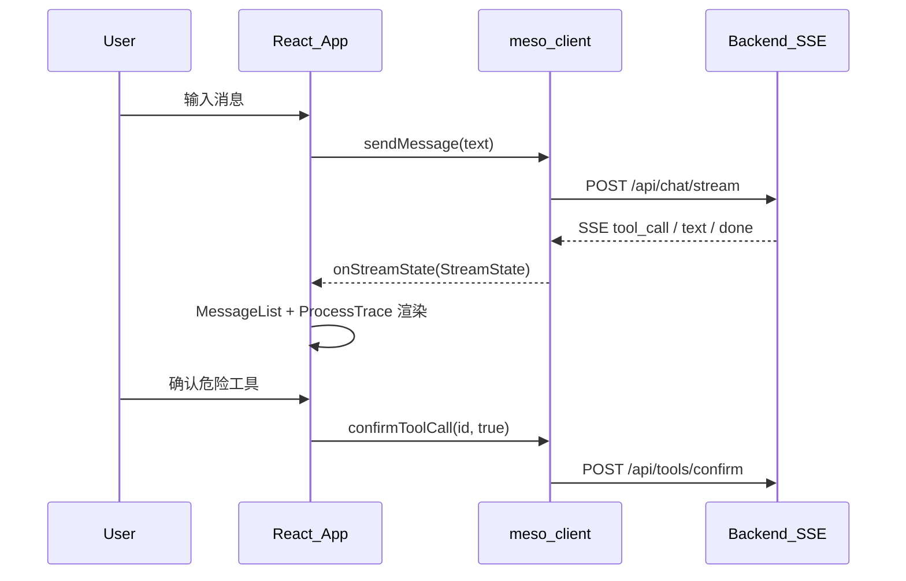

# 端到端接入 Recipe

从零拼出一个可运行的 Meso 消费应用（登录 → session → 发消息 → 持久化 → tool 确认）。

## 架构时序



## 1. 安装

```bash
pnpm add @meso.ai/ui @meso.ai/types @meso.ai/client
```

## 2. 前端骨架

```tsx
import { useState } from 'react'
import { ThreeColumnLayout, MessageList, ChatComposer } from '@meso.ai/ui'
import { createMesoSession } from '@meso.ai/client'
import '@meso.ai/ui/tokens.css'
import '@meso.ai/ui/style.css'

const session = createMesoSession({
  sessionId: 'demo-1',
  streamUrl: '/api/chat/stream',
  onStreamState: () => { /* trigger re-render */ },
})

export function App() {
  const [, tick] = useState(0)
  const refresh = () => tick(n => n + 1)

  return (
    <ThreeColumnLayout
      center={
        <>
          <MessageList
            messages={session.messages}
            streaming={session.streaming}
            onToolConfirm={(id) => { session.confirmToolCall(id, true); refresh() }}
            onToolCancel={(id) => { session.confirmToolCall(id, false); refresh() }}
          />
          <ChatComposer onSend={(text) => { session.sendMessage(text).then(refresh) }} />
        </>
      }
    />
  )
}
```

## 3. 后端（二选一）

- Python：[examples/fastapi-meso-starter](../../examples/fastapi-meso-starter/)
- Node：[examples/node-hono-sse](../../examples/node-hono-sse/)

## 4. 关键约定

| 职责 | 包 |
|------|-----|
| 协议 + 状态机 | `@meso.ai/types` |
| React 组件 + `useSSEStream` | `@meso.ai/ui` |
| session / 持久化 / tool 确认 | `@meso.ai/client` |

## 5. 验收清单

- [ ] `ProcessTrace` 默认嵌入 `MessageList`
- [ ] 危险工具显示 `ConfirmGate`，确认后 POST `/api/tools/confirm`
- [ ] 断线时可选 `useSSEStream({ reconnect: true })`
- [ ] 多 phase / 多 group 工具无需 extension 兜底
