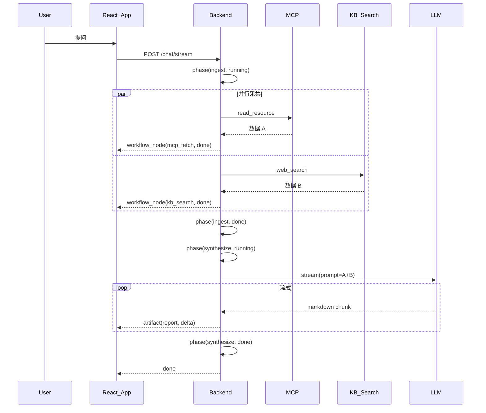

# 多源汇总最佳实践

把多个数据源（MCP 资源、知识库、网页搜索、内部 API）的查询结果融合为一份综合文档，是 Meso 的典型场景。本文说明平台提供了哪些**展示原语**，以及业务后端需要**自己实现**的部分。

---

## 设计原则：平台只渲染，不执行

Meso 协议与 UI 组件**只负责把后端已经发生的事情展示给用户**：
- 接收 SSE 事件、维护 `StreamState`、渲染卡片 / 阶段条 / 工具调用 / Artifact
- **不调用** LLM、不调 MCP、不跑 RAG、不执行 DAG

所有"取数 → 整合 → 生成"逻辑都在消费方后端实现，平台仅通过 SSE 输出可视化每一步。

---

## 平台 vs 消费方分工

| 环节 | 平台原语 | 消费方职责 |
|------|---------|----------|
| MCP 取数 | `resource_read` + `resource_content` → `ResourceReadBlock` | 调 MCP `read_resource`，序列化内容 |
| KB / 网页搜索 | `tool_call` + `tool_status` + `tool_result` → `ToolCallBlock` | RAG 检索、网页抓取、结果序列化 |
| 并行执行可视化 | `workflow_node`（同 `parent_id` 多子节点自动渲染并行分支）| DAG 执行器（LangGraph / Temporal / 自研）|
| 用户可见阶段 | `phase`（含 `body` / `pinned_think`）| 决定阶段粒度与文案 |
| 综合文档输出 | `artifact`（同 turn 多 id、lang="markdown" / "html preview"）| LLM 综合生成、prompt 整合 |
| 引用溯源 | `extension("citation")` + `renderExtension` | citation 数据结构、渲染器 |

**平台不实现**：
- RAG 检索、去重、排序
- Prompt 拼装、上下文管理
- LLM 综合生成（由消费方调 LLM）
- DAG 执行引擎
- 结果融合算法（Map-Reduce、加权排序等）

---

## 典型事件序列



`WorkflowTimeline` 会自动把 `mcp_fetch` 和 `kb_search`（同 `parent_id=null`）渲染为并行分支卡片，最终 `ArtifactPanel` 渲染综合 markdown 文档。

---

## Python 后端最小示例

```python
import json, asyncio

async def sse(event):
    event.setdefault("schema_version", "1.0")
    return f"data: {json.dumps(event)}\n\n"

async def multi_source_stream(query: str):
    # ── 阶段 1：多源采集 ──────────────────────
    yield sse({"type":"phase","payload":{"id":"ingest","name":"多源采集","state":"running"}})

    # 通知前端：两个并行节点开始
    yield sse({"type":"workflow_node","payload":{
        "run_id":"r1","node_id":"mcp_fetch","parent_id":None,
        "name":"mcp_fetch","state":"active"}})
    yield sse({"type":"workflow_node","payload":{
        "run_id":"r1","node_id":"kb_search","parent_id":None,
        "name":"kb_search","state":"active"}})

    # 同时可选：用标准事件展示明细
    yield sse({"type":"resource_read","payload":{
        "id":"rr1","uri":"file:///docs/spec.json","server":"fs-server"}})

    # 真实并行执行
    mcp_data, kb_data = await asyncio.gather(
        call_mcp("file:///docs/spec.json"),
        kb_search(query),
    )

    yield sse({"type":"resource_content","payload":{
        "resource_read_id":"rr1",
        "contents":[{"type":"text","text":mcp_data[:500]}]}})

    yield sse({"type":"workflow_node","payload":{
        "run_id":"r1","node_id":"mcp_fetch","state":"done","duration_ms":120}})
    yield sse({"type":"workflow_node","payload":{
        "run_id":"r1","node_id":"kb_search","state":"done","duration_ms":340}})

    yield sse({"type":"phase","payload":{
        "id":"ingest","name":"多源采集","state":"done",
        "pinned_think":f"MCP 返回 {len(mcp_data)} 字，KB 命中 {len(kb_data)} 条"}})

    # ── 阶段 2：综合生成 ──────────────────────
    yield sse({"type":"phase","payload":{
        "id":"synthesize","name":"综合生成","state":"running"}})

    # 把 citation 一起发出去，前端可挂脚注链接
    for hit in kb_data[:3]:
        yield sse({"type":"extension","payload":{
            "name":"citation",
            "data":{"source":hit.id,"title":hit.title,"url":hit.url}}})

    prompt = build_prompt(query, mcp_data, kb_data)
    async for chunk in llm_stream(prompt):  # 业务侧调 LLM
        yield sse({"type":"artifact","payload":{
            "id":"report","lang":"markdown","delta":chunk}})

    yield sse({"type":"artifact","payload":{
        "id":"report","lang":"markdown","delta":"","done":True}})

    yield sse({"type":"phase","payload":{
        "id":"synthesize","name":"综合生成","state":"done"}})

    yield sse({"type":"done","payload":{}})
```

---

## Node 后端最小示例

```typescript
import type { ServerResponse } from 'http'

function sse(res: ServerResponse, event: any) {
  res.write(`data: ${JSON.stringify({ schema_version: '1.0', ...event })}\n\n`)
}

async function multiSourceStream(res: ServerResponse, query: string) {
  sse(res, { type: 'phase', payload: { id: 'ingest', name: '多源采集', state: 'running' } })

  sse(res, { type: 'workflow_node', payload: {
    run_id: 'r1', node_id: 'mcp_fetch', parent_id: null, name: 'mcp_fetch', state: 'active' }})
  sse(res, { type: 'workflow_node', payload: {
    run_id: 'r1', node_id: 'kb_search', parent_id: null, name: 'kb_search', state: 'active' }})

  const [mcpData, kbData] = await Promise.all([
    callMcp('file:///docs/spec.json'),
    kbSearch(query),
  ])

  sse(res, { type: 'workflow_node', payload: {
    run_id: 'r1', node_id: 'mcp_fetch', state: 'done', duration_ms: 120 }})
  sse(res, { type: 'workflow_node', payload: {
    run_id: 'r1', node_id: 'kb_search', state: 'done', duration_ms: 340 }})

  sse(res, { type: 'phase', payload: { id: 'ingest', name: '多源采集', state: 'done' } })
  sse(res, { type: 'phase', payload: { id: 'synthesize', name: '综合生成', state: 'running' } })

  for (const hit of kbData.slice(0, 3)) {
    sse(res, { type: 'extension', payload: {
      name: 'citation', data: { source: hit.id, title: hit.title, url: hit.url } }})
  }

  const prompt = buildPrompt(query, mcpData, kbData)
  for await (const chunk of llmStream(prompt)) {
    sse(res, { type: 'artifact', payload: { id: 'report', lang: 'markdown', delta: chunk } })
  }
  sse(res, { type: 'artifact', payload: { id: 'report', lang: 'markdown', delta: '', done: true } })

  sse(res, { type: 'phase', payload: { id: 'synthesize', name: '综合生成', state: 'done' } })
  sse(res, { type: 'done', payload: {} })
}
```

---

## 前端渲染效果

只要后端按上述序列发事件，前端**零自定义代码**就能渲染：

- `ProcessTrace`（默认嵌在 `MessageList` 内）展示阶段进度
- `WorkflowTimeline` 在阶段内渲染并行分支（mcp_fetch / kb_search）
- `ResourceReadBlock` 展示 MCP 读取的文件摘要
- `ArtifactPanel` 渲染最终 markdown 综合文档（支持流式增量）
- 通过 `MessageList.renderExtension` 自定义 citation 卡片样式

---

## 引用溯源（citation）

综合文档通常需要标注"这段内容来自哪个来源"。Meso 不内置 citation 原语，但 `extension` 事件是标准逃生通道：

```tsx
import type { ExtensionEvent } from '@meso.ai/ui'

<MessageList
  messages={messages}
  streaming={state}
  renderExtension={(event: ExtensionEvent) => {
    if (event.payload.name === 'citation') {
      const d = event.payload.data as { source: string; title: string; url?: string }
      return <a href={d.url}>{d.title}</a>
    }
    return null
  }}
/>
```

详细用法见 [扩展事件](extension.md)。

---

## 不做什么（明确划界）

以下能力**不属于 Meso 平台职责**，由消费方业务后端自行实现：

| 能力 | 为什么不在平台 |
|------|--------------|
| RAG 向量检索 | 业务领域强相关，技术栈多样（PGVector / Pinecone / 自研）|
| 文档分块 / Embedding | 数据预处理，与运行时渲染无关 |
| 去重、排序、融合算法 | 业务策略，无法统一 |
| Prompt 拼装 / 上下文压缩 | 与具体 LLM 强相关 |
| DAG 执行引擎 | 平台只观测，不执行；用 LangGraph / Temporal / 自研 |
| Citation schema 标准 | 业务定义不同（学术论文 vs 工单 vs 文档段落）|

---

## 相关文档

- [DAG 工作流可观测性](workflow.md) — `workflow_node` 完整规范与并行渲染规则
- [工具调用](tools.md) — `tool_call` / `tool_status` / `tool_result` 序列
- [扩展事件](extension.md) — citation / entity_reference 等自定义事件
- [SSE 协议](protocol.md) — `phase` / `artifact` / `resource_read` 字段定义
- [应用场景](usecases.md) — RAG 知识问答、研究助手等完整场景
