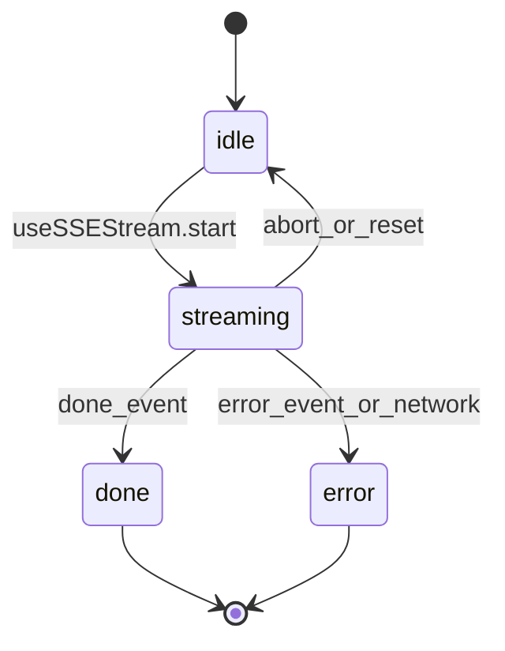
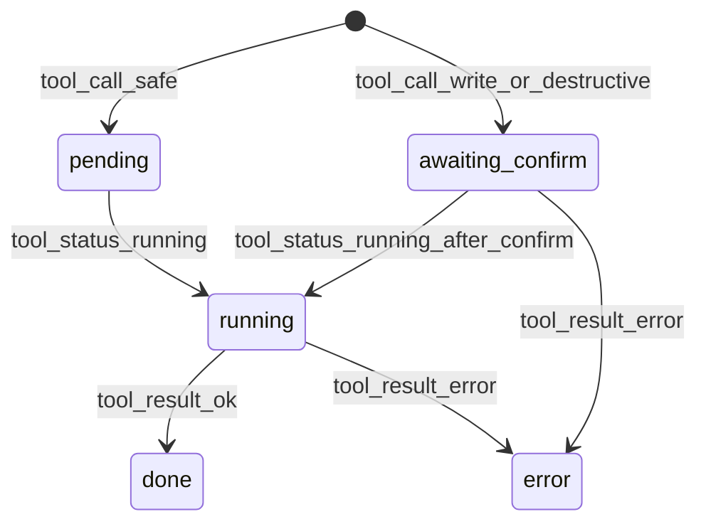

# 状态机参考

`applyEvent` 是纯函数 reducer：`StreamState × SSEEvent → StreamState`。

## 流级状态

## tool_call 状态

## 关键规则

- `done` 与 `error` 互斥，均终止流
- `tool_result` 保留 `groupId` / `groupKind`
- `error.code` 写入 `StreamState.errorCode`
- `phase` 事件创建/更新 `phases[id]`；`think.phase_id` 路由到对应 phase

权威实现：[`packages/meso-types/src/applyEvent.ts`](../../packages/meso-types/src/applyEvent.ts)

契约测试：[`packages/meso-types/src/__tests__/runtime.contract.test.ts`](../../packages/meso-types/src/__tests__/runtime.contract.test.ts)
